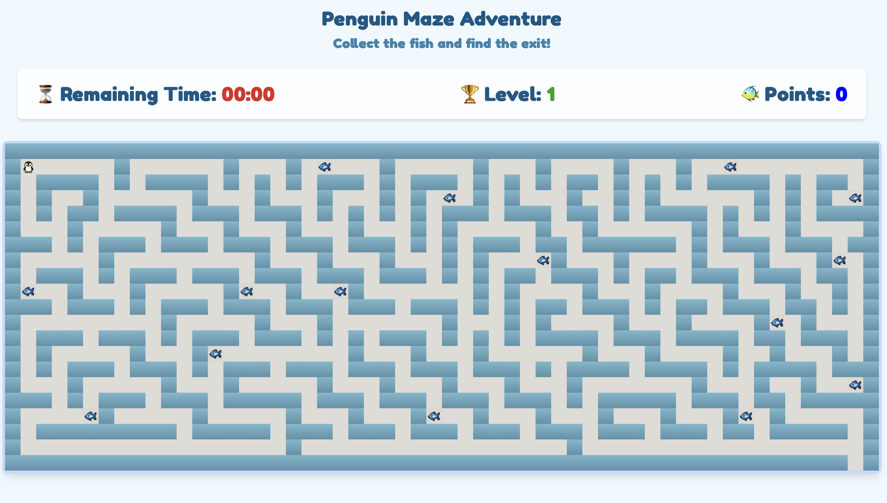
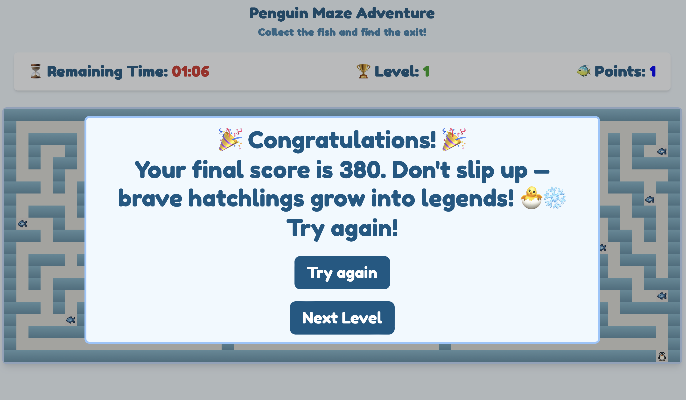

# 🐧 Penguin Maze Adventure

## 📖 Description

Penguin Maze Adventure is a **maze-style browser game** where you control a penguin 🐧.  
The goal is to collect fish 🐟, avoid hidden traps like ice holes 🧊 and bears 🐻, and reach the maze exit before time runs out.  

The game features several levels, a timer, sound effects, and a nostalgic arcade vibe inspired by the classic **Bomberman** game — but with penguins!

## 🎮 Instructions to Play

- Use the **arrow keys** (⬆️⬇️⬅️➡️) to move the penguin through the maze.
- Collect all the **fish** 🐟 and avoid:
  - **Ice holes** 🧊 — they send you back to the start.
  - **Bears** 🐻 — they end the game immediately.
- Try to reach the exit before time runs out!
- Your **score** is based on fish collected and time left.

## 📸 Screenshots

  

## 🚀 Demo

👉 [Play Penguin Maze Adventure Here](https://katerynasoloviova.github.io/penguin_maze_adventure_project/src/)